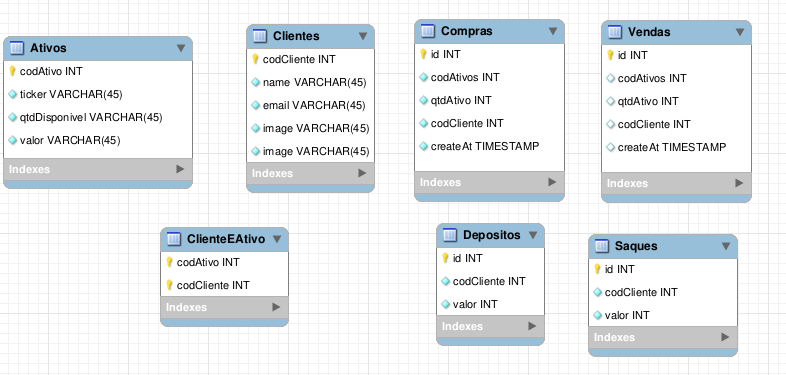
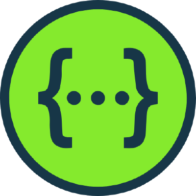

# Boas-vindas ao meu repositório do projetoXp!

<details>
  <summary><strong>👨‍💻 Resumo do desenvolvimento</strong></summary>
  
  Nestre projeto desenvolvi uma `API` e um `banco de dados` para um app que possibilita os usuários negociarem a compra e venda de ações. Desenvolvi essa aplicação em `Node.js` usando o pacote `sequelize`. A aplicação possui diversos endpoints (veja o [Swagger](https://projetoxp.herokuapp.com/apiDocs/) dessa aplicação), testes unitários, testes de integração, docker tanto para a aplicação quanto para a base de dados. A base de dados está hospedada na [SupaBase](https://app.supabase.com/) e a aplicação no [Heroku](https://projetoxp.herokuapp.com/)
</details>

<br />

# Para rodar o projeto localmente

Fiz o docker da minha aplicação pensando em receber PRs e para que possam avaliar meu projeto, localmente,sem problemas 😁. Para isso nada mais justo do que fazer um docker da aplicação e da base de dados.

<details>
  <summary><strong>🐋 O Docker do projeto</strong></summary>

  ## 👉 Aviso sobre a versão do docker compose:
 
  **:warning: Seu docker-compose precisa estar na versão 1.29 ou superior. [Veja aqui](https://www.digitalocean.com/community/tutorials/how-to-install-and-use-docker-compose-on-ubuntu-20-04-pt) ou [na documentação](https://docs.docker.com/compose/install/) como instalá-lo. No primeiro artigo, você pode substituir onde está com `1.26.0` por `1.29.2`.**

**:warning:** **TODOS** os comandos disponíveis no `package.json` (npm start, npm test, npm run dev, ...) devem ser executados **DENTRO** do container, ou seja, no terminal que aparece após a execução do comando `docker exec` citado acima. 

**:warning:** O **git** dentro do container não vem configurado com suas credenciais. Indico que realizem comandos com **git** fora do container (aonde suas credenciais estão cadastradas). 


  > :information_source: Utilizei o docker compose, então para que consiga rodar localmente o projeto é necessário que rode os serviços `node` e `db` com o comando `docker-compose up -d --build`.

  - A base de dados do desenvolvimento é `MySQL` e container irá execulata, localmente, na porta padrão `3306`. Lembre-se de deixa-la livre.

  - Se chegou até aqui então conseguiu, ao ter executado o comando acima, criar e inicializar dois containers: os `projeto_xp` e o `projeto_xp_db`;

  - Agora você conseguirá executara o container `projeto_xp` via CLI ou abri-lo no VS Code. Para ter acesso ao terminal interativo do container criado pelo compose basta rodar o comando a seguir.

  > :information_source: Use o comando `docker exec -it projeto_xp bash`.

  - Lembre-se de instalar as depêndencias, dentro do container, com o seguinte comando: 
  > :information_source: Instale as dependências com o `npm install`.

  <br/>
</details>

<details>
  <summary  id="diagrama"><strong>🎲 Base de dados</strong></summary>
  A Base de dados, local, utilizada foi a `MySQL` e as configurações de ambiente desta base está tanto no [arquivo](docker-compose.yml).

  A figura a seguir mostra como a `base de dados` está estruturada.

  

 ## 🗣 Dicas de comandos prontos:
 Para facilitar a usabilidade criei alguns comandos que facilitão o uso do projeto. 

- Cria o banco:
```json
"createdb": "npx sequelize-cli db:create""
```
- Cria o banco:
```json
"migrate":"npx sequelize-cli db:create""
```
 - Popular as tabela:
```json
"seed": "npx sequelize-cli db:migrate"
```
- Dropa o banco:
```json
"drop": "npx sequelize-cli db:drop"
 ```

**:warning:** Lembre-se de usar o `npm run` antes desses comandos (veja o pack.json para mais comandos).
</details>

<br />

# Tecnologias
<p align="center">

  
  
  
  
  
  
    </div>
  </p>
<br />

# Endpoints
Irei me concentrar, nesse momento, em mostrar como a API está bem "integrada" com a base de dados. Você pode acessar todos os endPoints do meu projeto utilizando o [Swagger](https://projetoxp.herokuapp.com/apiDocs/). Vou falar sobre como alguns endPoints afetam a base de dados. 

**:warning:** Teste os demais endpoints no [Swagger](https://projetoxp.herokuapp.com/apiDocs/). Aqui só falei de alguns.
</details>
<br />

1 - POST /login:
<br />
-  É nesse momento que o cliente cadastrado entra em sua conta e gera um token que o permite acessar algunss endPoints específicos.
- Caso não seja um cliente cadastrado ele pode se cadastrar utilizando o endPoint /newCliente. Veja no [Swagger](https://projetoxp.herokuapp.com/apiDocs/) como fazer esta operação.
<br />

2 - POST /investimentos/vender:
<br />
-  Um cliente não consegue entrar nas carteiras de outros.
-  Não conseguem vender ativos com o codCliente de outros.
-  A venda só é autorizada se o agente possuir aquele montante de ações.
-  Caso a venda seja autorizada o saldo do cliente é atualizado na proporção exata da venda (`assumi aqui que a taxa de corretagem é zero`). 
-  A quantidade restante desse ativo na carteira é decrecida (caso tenha sobrado algum). 
- A quantidade deste ativo, disponível para ele comprar no mercado, aumenta.
<br />

3 - POST /investimentos/comprar:
<br />
-  A compra só é autorizada se: 
    -  O agente possuir um montante de saldo adequado.
    -  A quantidade demandada não superar a oferta do mercado (`disponibilidade desta ação, para a venda, na corretora`).
-  Caso a compra seja autorizada o saldo do cliente é atualizado na proporção exata da compra (`assumi aqui que a taxa de corretagem é zero`). 
-  A quantidade deste ativo na carteira do cliente é acrescida.
    - Caso essa seja a primeira vez que ele compra o ativo, então, ela surge em sua carteira.
- A quantidade deste ativo, disponível para ele comprar no mercado, diminui.
<br />

4 - POST /conta/deposito:
<br />
-  Um agente só consegue depositar se estiver logado em sua conta. 
-  Não  é permitido depositar em uma conta estando logado em outra.
-  Ao depositar uma quantidade, em sua conta, o seu saldo é acrescido neste momtante. 
<br />

5 - POST /conta/saque:
<br />
-  Um agente só consegue sacar se estiver logado em sua conta.
-  Não  é permitido sacar em uma conta estando logado em outra.
-  Não é permitido saques mais altos que o saldo do agente (`O saldo na carteira não pode ser menor que zero`)
-  Ao sacar uma quantidade, da sua conta, o seu saldo é decrescido neste momtante. 
<br />

6 - GET /assets:
<br />
-  Esse endpoint disponibiliza todas as ações (`corretora + carteiras`). A primeira KEY desse objeto é um outro array que contem todos os ativos da corretora. A segunda KEY é um array cujo cada elemento é um objeto que contem o codCliente e os ativos deste cliente.
-  Optei por colocar o codCliente para especificar de que carteira estamos falando.
<br />

# Sobre algumas tomadas de decisões


Utilizei a variável de ambiente `NODE_ENV`(localizada no .env) para mudar o ambiente. Ao desmarcar essa variável tudo será rodado na produção.

Ao resalizar o login com algun usuário, diferente do admin, algunas rotas estarão indisponíveis. O admin, não pode acessar a rota de depósitos/saques dos clientes. Um cliente não conseguirá acessar uma rota que tenha informações dos outros clientes. 

Ao realizar a troca de email (`atravéz da rota de update do email`) vc deve relogar para que um novo token seja criado. 

Escolhi utilizar o `sequelize` neste projeto, pois, é um ORM muito conhecido para o `Node.js`. Ele possui suporte aos bancos de dados como: MariaDB, PostgreSQL, SQLite, MySQL, SQLite e MSSQL. Como ORM ele faz o mapeamento de dados relacionais (tabelas, colunas e linhas) para objetos Javascript. Por essa versatilidade eu tenho um amplo leque de escolhas de base de dados, podendo diferenciar a base de produção e de desenvolvimento (`como eu fiz nesse projeto.`).

Fiz o `docker` do meu `projeto` e da minha `base de dados` para não haver nenhuma preocupação da usabilidade deste projeto em outros ambientes de desenvolvimentos com configurações diferentes da minha. 

Tive alguns problemas em fazer testes unitários com o `sequelize`. Precisei mockar toda a base de dados e criar umas psceudos funções que simulam o comportamento do sequelize (`o comportamento da camada de model`). Esses Mocks estão na pasta test/mocks/models. Isso afetou minha capacidade em fazer testes unitários. Para não deixar a aplicação sem muitos testes optei por fazer alguns `testes de integrações`, buscando complementar os testes unitários. A aplicação ainda precisa de mais testes.


